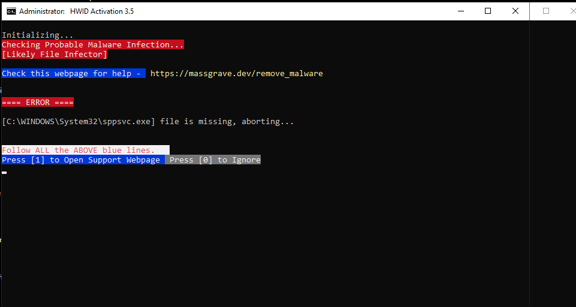
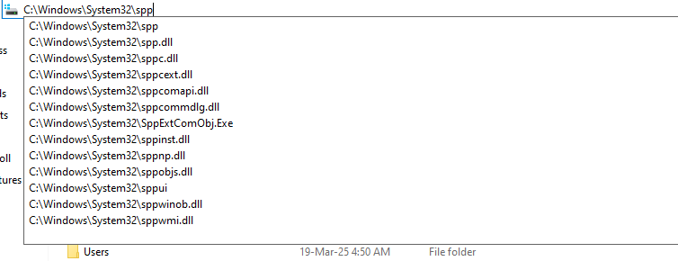
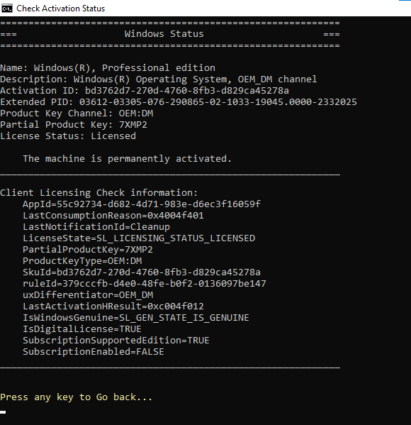
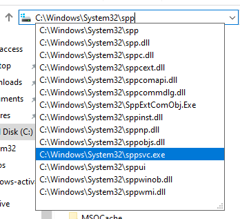

# 📸 Windows Activation Recovery – Screenshots

This document captures key stages of the recovery journey — from malware-induced failure to successful activation. Each image reinforces the technical depth and strategic thinking behind the process.

---
---

### 🧠 Errors Encountered – Component Breakdown  
This diagnostic table summarizes the failure state of core licensing components. It highlights missing files (`tokens.dat`), broken services (`sppsvc`, `SoftwareLicensingService`), and registry corruption — all of which contributed to activation failure.

### 🚨 Malware-Induced Failure Detected  
HWID Activation tool flags a probable file infector. `sppsvc.exe` is missing, halting activation. This marks the beginning of the recovery journey.

---

### 📂 Missing `sppsvc.exe` in System32  
File Explorer confirms `sppsvc.exe` is absent from `C:\Windows\System32\spp`, validating the malware alert and confirming service-level damage.

---

### 🧩 Component Status Breakdown  
A diagnostic table reveals multiple activation components in failure state — including `sppsvc`, `tokens.dat`, registry corruption, and SKU mismatches. This snapshot guided the recovery strategy.

---

### ✅ Successful Activation via CLI  
Captured after executing the Microsoft Activation CLI tool. Confirms Windows 10 Pro is permanently activated with a digital license and genuine status.

---

### 🔍 Verifying `sppsvc.exe` Location After Recovery  
File Explorer view of `C:\Windows\System32\spp`, confirming that `sppsvc.exe` has been successfully restored. This validates the recovery and registry repair steps.

